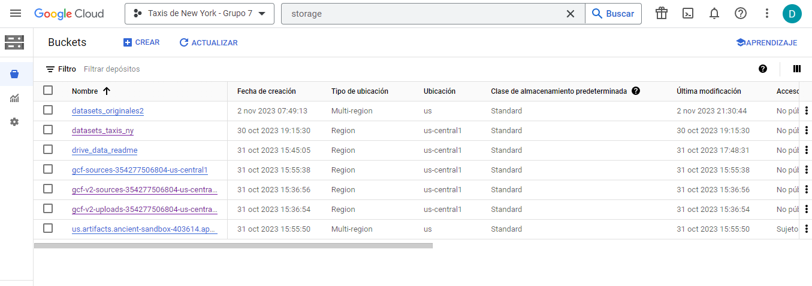
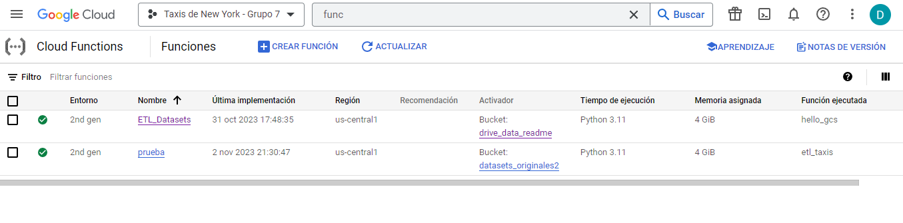

## EXTRACCION TRANSFORMACION Y CARGA

## INDICE 
<!-- TABLA DE CONTENIDO -->

  
TABLA DE CONTENIDO

  <ol>  
    <li><a href="#PIPELINE">PIPELINE</a></li>
    <li><a href="#STACK-TECNOLOGICO">STACK TECNOLOGICON</a></li>
    <li><a href="#DATA-LAKE">DATA LAKE</a></li>
    <li><a href="#CLOUD-FUNCTIONS">CLOUD FUNCTIONS</a></li>
    <li><a href="#DATA-WAREHOUSE">DATA WAREHOUSE</a></li>
    <li><a href="#VIDEO">VIDEO</a></li>
  </ol>

## PIPELINE

Flujo de trabajo para la transformación de los conjuntos de datos en Google Cloud Plataform.

## STACK TECNOLOGICO

## DATA LAKE

Se cargan los datos sin ningún tipo de transformación en Google Cloud Storage de manera manual, como el paso inicial para la creación del Data Lake del proyecto.

## CLOUD FUNCTIONS

## DATA WAREHOUSE

