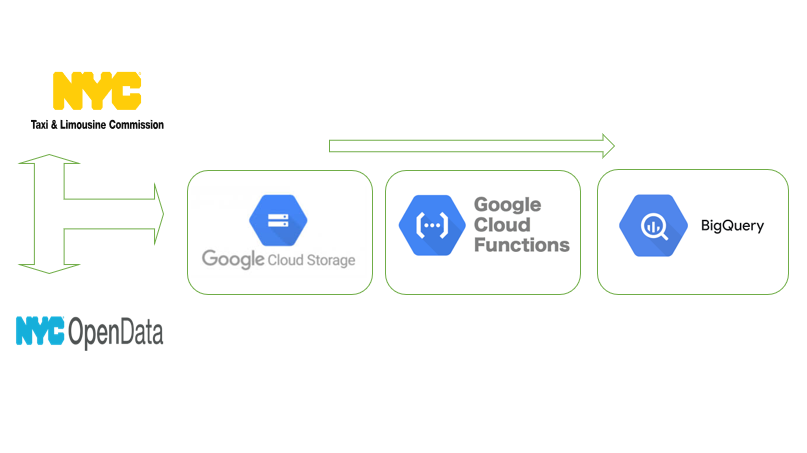

## EXTRACCION TRANSFORMACION Y CARGA

## INDICE 
<!-- TABLA DE CONTENIDO -->

  
TABLA DE CONTENIDO

  <ol>  
    <li><a href="#PIPELINE">PIPELINE</a></li>
    <li><a href="#STACK-TECNOLOGICO">STACK TECNOLOGICON</a></li>
    <li><a href="#DESCRIPCION-DEL-PROBLEMA">DESCRIPCION DEL PROBLEMA</a></li>
    <li><a href="#OBJETIVO-GENERAL">OBJETIVO GENERAL</a></li>
    <li><a href="#OBJETIVOS-ESPECIFICOS">OBJETIVOS ESPECIFICOS</a></li>
    <li><a href="#INDICADORES-DE-RENDIMIENTO-KPI'S">INDICADORES DE RENDIMIENTO KPI'S</a></li>
    <li><a href="#METODOLOGIA-DE-TRABAJO">METODOLOGIA DE TRABAJO</a></li>
    <li><a href="#STACK-TECNOLOGICO">STACK TECNOLOGICO</a></li>
    <li><a href="#DIAGRAMA-DE-GANTT">DIAGRAMA DE GANTT</a></li>
    <li><a href="#ANALISIS-PRELIMINAR-DE-DATOS">ANALISIS PRELIMINAR DE DATOS</a></li>
  </ol>

## PIPELINE

Flujo de trabajo para la transformación de los conjuntos de datos en Google Cloud Plataform.

## STACK TECNOLOGICO

