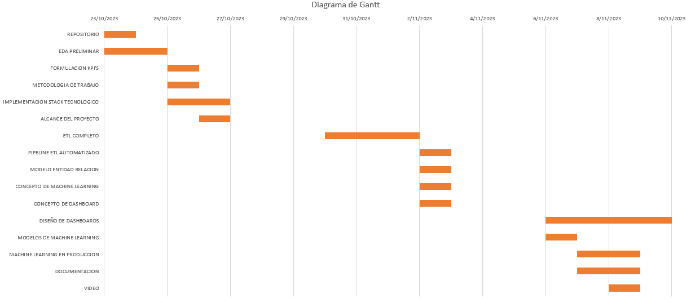

# Taxis-Nueva-York-y-CO2

# EQUIPO DE TRABAJO "DATA OK"

El grupo 7 del proyecto final de Henry de la carrera de Data Science está conformado por las siguientes personas y según sus habilidades desempeñarán los roles a continuación:

1. Néstor Cardona - Data Engineer
2. Giovanny Muñoz - Data Scientist
3. Santiago Magris - Data Engineer
4. Ramiro Tejedor - Data Engineer
5. William Flórez - Data Scientist

## INDICE 
<!-- TABLA DE CONTENIDO -->

  
Tabla de contenido

  <ol>  
    <li><a href="#Introducción">Introducción</a></li>
    <li><a href="#Objetivo">Objetivo</a></li>
    <li><a href="#pila-de-tecnologías">Pila de Tecnologías</a></li>
    <li><a href="#ETL">ETL</a></li>
    <li><a href="#EDA">EDA</a></li>
    <li><a href="#modelo-ml">Modelo ML</a></li>
    <li><a href="#Video">Video</a></li>
  </ol>

# INTRODUCCION

El siguiente proyecto analiza varios conjuntos de datos que entregan información acerca del negocio de transporte en la ciudad de Nueva York, plataformas de viajes y taxis son los protagonistas principales, de la misma manera contamos con datos que informan la calidad del aire y la contaminación sonora en la ciudad. El equipo analizará estos datos para brindar un modelo de predicción de machine learning y desarrollará objetivos de investigación y propondrá KPI' s para medir el cumplimiento de esos objetivos. Con el fin de robustecer la fuente de información encontrará nuevos conjuntos de datos que emplíen el espectro de análisis. 

# DESCRICPCION DEL PROBLEMA

El servicio de transporte particular de pasajeros ha tenido un mayor incremento desde la aparición de empresas como uber, llegando a competir con el servicio tradicional de taxis. Esto implica una mayor circulación constante de vehículos en la ciudad de Nueva York, por lo tanto mayores emisiones de CO2 e incremento de la contaminación acústica. La empresa 'TransFast' estudia la posibilidad de invertir en el sector de transporte de pasajeros en automóviles con la visión de una ciudad menos contaminada, para esto pretente participar en este sector con una flota de vehículos eléctricos con la finalidad de contribuir al cuidado del medio ambiente y además evaluar la rentabilidad de la inversión.
La empresa 'TransFast' con la ayuda de la consultora 'dataok' desarrollará este proyecto para definir su viabilidad y suministrar las posibles oportunidades en el mercado.

# OBJETIVO ESPECIFICO

Crear un modelo de machine learning que entregue al usuario, según un punto de partida y de destino y una hora de viaje, la predicción del costo del servicio.

# OBJETIVOS GENERALES

1. Identificar los distritos más contaminados, en términos de calidad de aire y exceso de ruido.
2. Definir la rentabilidad del negocio de transporte de pasajeros en automóviles por distritos.
3. Entregar una propuesta de inversión a TransFast que ayude a tomar la decisión de participar o no en el mercado.

# INDICADORES DE RENDIMIENTO KPI'S

para un periodo de tiempo comprendido entre 2020 y 2022:

1. Medir el Co2 por kilómetro cuadrado.
2. Medir la emisión de Co2 en toda la ciudad en los últimos.
3. Conocer el comportamiento de la rentabilidad distrito a distrito.
4. Cuantificar la varianza de la tarifa de viajes.
5. Analizar la varianza de la contaminación sonora.
6. Analizar la varianza de la contaminación del aire.

# STACK TECNOLOGICO

empezamos!

# Diagrama de Gantt

