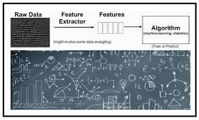

# INGENIERIA DE CARACTERISTICAS (FEATURE ENGINEERING)

Hace referencia al proceso de selección, transformación y creación de variables desde los datos crudos con la intención de mejorar el rendimiento de un modelo de aprendizaje automático. Es fundamental para preparar los datos para aplicaciones de inteligencia artificial y aprendizaje automático.

## SELECCION DE CARACTERISTICAS

Basados en los objetivos del proyecto se escogieron aquellos conjuntos de datos que entregaron información clave para cumplirlos.

## TRANSFORMACION DE CARACTERISTICAS

Se aplicaron técnicas como la normalización, la codificación de variables categóricas y la extracción de características para mejorar la calidad de datos.

## CREACION DE NUEVAS CARACTERISTICAS

Con la aplicación de operaciones matemáticas, combinaciones y agregaciones se obtienen nuevas características en los conjuntos de datos para cumplir nuestro objetivo de desarrollar el modelo de aprendizaje automático y desarrollar un tablero de control que ayude a la decisión de inversión por parte de la empresa.

## MANEJO DE VALORES FALTANTES

Aquellos datos considerados como atípicos fueron analizados y si defintivamente lo eran, fueron eliminados del conjunto de datos, otros por ejemplo, se imputaron siguiendo las reglas para tal fin, dejando datos totalmente limpios y útiles para el avance del proyecto.

# INFORME DE ANALISIS DE DATOS

## EXPLORACION DE DATOS

En esta etapa se utiliza estadística descriptiva, correlación entre variables, análisis gráfico para evidenciar patrones y conocer que información contiene el conjunto de datos.

## METODOLOGIA

1. Definición de objetivos
2. Recolección de datos
3. EDA
4. ETL
5. Selección de características
6. Modelado de datos
7. Validación y evaluación del modelo
8. Interpretación de resultados
9. Toma de decisiones
10. Despliegue

## CONCLUSIONES

La mayoría de los datos analizados contribuye en gran manera al objetivo del proyecto, en términos generales los datos están muy limpios y no sufren grandes transformaciones.

## LIMITACIONES

Los datos son obtenidos principalmente de la fuente entregada por Henry y complementada con otras para dar un contexto mas amplio del problema a analizar.